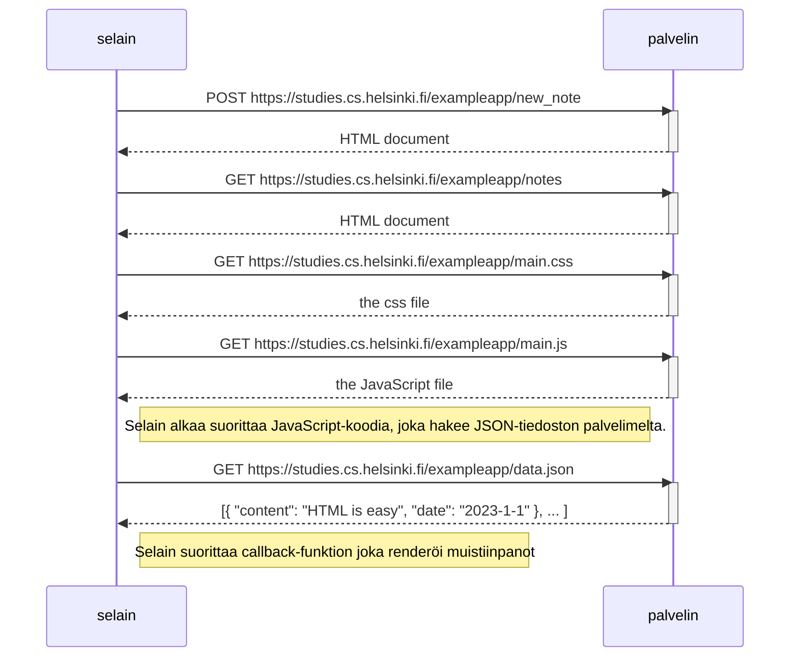

```mermaid
sequenceDiagram
    participant selain
    participant palvelin
    
    selain->>palvelin: POST https://studies.cs.helsinki.fi/exampleapp/new_note
    activate palvelin
    palvelin-->>selain: HTML document
    deactivate palvelin

    selain->>palvelin: GET https://studies.cs.helsinki.fi/exampleapp/notes
    activate palvelin
    palvelin-->>selain: HTML document
    deactivate palvelin
    
    selain->>palvelin: GET https://studies.cs.helsinki.fi/exampleapp/main.css
    activate palvelin
    palvelin-->>selain: the css file
    deactivate palvelin
    
    selain->>palvelin: GET https://studies.cs.helsinki.fi/exampleapp/main.js
    activate palvelin
    palvelin-->>selain: the JavaScript file
    deactivate palvelin
    
    Note right of selain: Selain alkaa suorittaa JavaScript-koodia, joka hakee JSON-tiedoston palvelimelta.
    
    selain->>palvelin: GET https://studies.cs.helsinki.fi/exampleapp/data.json
    activate palvelin
    palvelin-->>selain: [{ "content": "HTML is easy", "date": "2023-1-1" }, ... ]
    deactivate palvelin    

    Note right of selain: Selain suorittaa callback-funktion joka renderöi muistiinpanot
```
